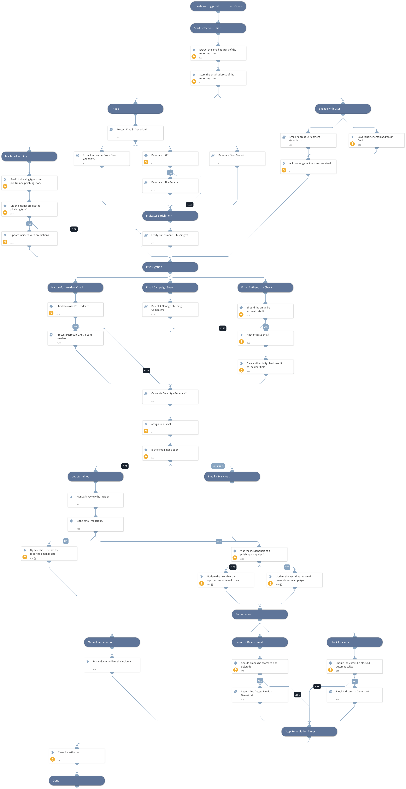

Use this playbook to investigate and remediate a potential phishing incident. The playbook simultaneously engages with the user that triggered the incident, while investigating the incident itself.

The final remediation tasks are always decided by a human analyst.

Main additions to this version:
1) Changing all labels to incident fields
2) Use "Process Email - Generic v2" (replaces the older version)
3) Adding "Detonate URL - Generic" playbook

## Dependencies
This playbook uses the following sub-playbooks, integrations, and scripts.

### Sub-playbooks
* Calculate Severity - Generic v2
* Email Address Enrichment - Generic v2.1
* Extract Indicators From File - Generic v2
* Block Indicators - Generic v2
* Detect & Manage Phishing Campaigns
* Detonate File - Generic
* Process Email - Generic v2
* Process Microsoft's Anti-Spam Headers
* Entity Enrichment - Phishing v2
* Detonate URL - Generic
* Search And Delete Emails - Generic v2

### Integrations
This playbook does not use any integrations.

### Scripts
* AssignAnalystToIncident
* DBotPredictPhishingWords
* CheckEmailAuthenticity
* Set

### Commands
* send-mail
* extractIndicators
* setIncident
* closeInvestigation

## Playbook Inputs
---

| **Name** | **Description** | **Default Value** | **Required** |
| --- | --- | --- | --- |
| Role | The default role to assign the incident to. | Administrator | Required |
| SearchAndDelete | Enable the "Search and Delete" capability \(can be either "True" or "False"\). In case of a malicious email, the "Search and Delete" sub-playbook will look for other instances of the email and delete them pending analyst approval. | False | Optional |
| BlockIndicators | Enable the "Block Indicators" capability \(can be either "True" or "False"\). In case of a malicious email, the "Block Indicators" sub-playbook will block all malicious indicators in the relevant integrations. | False | Optional |
| AuthenticateEmail | Whether the authenticity of the email should be verified, using SPF, DKIM and DMARC. | False | Optional |
| OnCall | Set to true to assign only user that is currently on shift. Requires Cortex XSOAR v5.5 or later. | false | Optional |
| SearchAndDeleteIntegration | Determines which product and playbook will be used to search and delete the phishing email from users' inboxes. Set this to "O365" to use the "O365 - Security And Compliance - Search And Delete" playbook. Set this to "EWS" to use the "Search And Delete Emails - EWS" playbook. Set this to "Gmail" to use the "Search And Delete - Gmail" playbook. | EWS | Optional |
| O365DeleteType | The method by which to delete emails using the O365 - Security And Compliance - Search And Delete playbook. Could be "Soft" \(recoverable\), or "Hard" \(unrecoverable\). Leave empty to decide manually for each email incident. This is only applicable if the SearchAndDeleteIntegration input is set to O365. | Soft | Optional |
| O365ExchangeLocation | Used only when searching and deleting emails in O365. The exchange location. Determines from where to search and delete emails searched using O365 playbooks. Use the value "All" to search all mailboxes, or use $\{incident.emailto\} to search and delete the email only from the recipient's inbox. Note - searching all mailboxes may take a significant amount of time. This input is only applicable if the SearchAndDeleteIntegration input is set to O365. | incident.emailto | Optional |
| O365AllowNotFoundSearchLocations | Used only when searching and deleting emails in O365. Whether to include mailboxes other than regular user mailboxes in the compliance search. Default is "false". | false | Optional |
| O365ExchangeLocationExclusion | Used only when searching and deleting emails in O365. Comma-separated list of mailboxes/distribution groups to exclude when you use the value "All" for the O365ExchangeLocation input. |  | Optional |
| CheckMicrosoftHeaders | Check Microsoft's headers for BCL/PCL/SCL scores and set the "Severity" and "Email Classification" accordingly. | True | Optional |
| InternalDomains | A CSV list of internal domains. The list will be used to determine whether an email address is internal or external. |  | Optional |
| DetonateURL | Whether to use URL Detonation playbook or not. When detonating a URL it's possible that it will take a few minutes. False is default. | True | Optional |

## Playbook Outputs
---
There are no outputs for this playbook.

## Playbook Image
---
